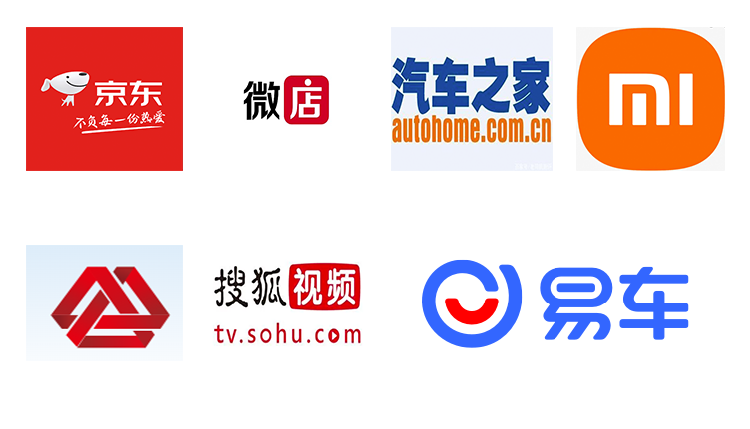

# hotkey

备注：有需要存储海量日志的场景，秒级GB级或数十GB级，可关注我的另一个开源项目[JLog](https://gitee.com/jd-platform-opensource/jlog)，较ELK系列套件在处理日志方面提升10倍性能，且存储降低70%以上。

以下为hotkey相关

.png")

对任意突发性的无法预先感知的热点数据，包括并不限于热点数据（如突发大量请求同一个商品）、热用户（如恶意爬虫刷子）、热接口（突发海量请求同一个接口）等，进行毫秒级精准探测到。然后对这些热数据、热用户等，推送到所有服务端JVM内存中，以大幅减轻对后端数据存储层的冲击，并可以由使用者决定如何分配、使用这些热key（譬如对热商品做本地缓存、对热用户进行拒绝访问、对热接口进行熔断或返回默认值）。这些热数据在整个服务端集群内保持一致性，并且业务隔离，worker端性能强悍。

京东APP后台热数据探测框架，历经多次高压压测和2020年京东618、双11大促考验。

在上线运行的这段时间内，每天探测的key数量数十亿计，精准捕获了大量爬虫、刷子用户，另准确探测大量热门商品并毫秒级推送到各个服务端内存，大幅降低了热数据对数据层的查询压力，提升了应用性能。

在大促期间，hotkey的worker集群秒级吞吐量达到1500万级别，由hotkey探测出的热key进而产生的本地缓存占应用总访问量的50%以上，使得大部分请求进行的是本地查询，减轻了redis层一半以上负担。

该框架历经多次压测，性能指标主要有两个：

1 探测性能：8核单机worker端每秒可接收处理16万个key探测任务，16核单机至少每秒平稳处理30万以上，实际压测达到37万，CPU平稳支撑，框架无异常。

2 推送性能：在高并发写入的同时，对外推送目前性能约平稳推送每秒10-12万次，譬如有1千台server，一台worker上每秒产生了100个热key，那么这1秒会平稳推送100 * 1000 = 10万次，10万次推送会明确在1s内全部送达。如果是写入少，推送多，以纯推送来计数的话，该框架每秒可稳定对外推送40-60万次平稳，80万次极限可撑几秒。

每秒单机吞吐量（写入+对外推送）目前在70万左右稳定。

在真实业务场景中，可用1：1000的比例，即1台worker支撑1000台业务服务端的key探测任务，即可带来极大的数据存储资源节省（如对redis集群的扩充）。测试详情可去我[CSDN博客](https://blog.csdn.net/tianyaleixiaowu)查看。

#### 架架架架架架架架架架架构构构构构构构构构构构设设设设设设设设设设计计计计计计计计计计计计
 **见京东零售公众号** 
https://mp.weixin.qq.com/s/xOzEj5HtCeh_ezHDPHw6Jw

 **！！！！！！！！！！！！！！！！重要！！！！！！！！！！！！！！！不然看不懂框架原理** 

#### 参与开发
该框架的开发得到了来自于：

京东数科-生活服务研发组-李云峰的大力支持，完成了整个dashboard控制台的研发。

京东零售-平台业务中心-APP后台架构师 杜晓宇的大力支持，参与并帮助解决了诸多技术难题。

京东零售-平台业务中心-PC购物车业务组 任启恒，进行了多次极限压测及功能验证，为框架的健壮性提供了更高的标准。

京东零售-技术与数据中心-订单研发组 姜坤坤，进行了漫长和覆盖更加全面的功能验证，协助进行了bug发现和bugfix。

京东零售-平台业务中心-业务测试部 郭世儒，配合进行了多次军演模拟压力测试演练，协助验证框架在模拟真实流量时的表现。

京东数科-消费金融研发部-账务服务 王小飞，对框架提出了重要的功能新增建议，以及新增功能的协助验证。

外部开发者，来自于[lowbMan](https://gitee.com/lowbMan)提供了关于修改proto序列化方式的建议，以及其他有相当价值的优化建议。

另有京东集团多个部门提供的意见、建议，和对框架的见解、优化方案。

在此一起感谢。

#### 介绍
对任意突发性的无法预先感知的热点请求，包括并不限于热点数据（如突发大量请求同一个商品）、热用户（如爬虫、刷子）、热接口（突发海量请求同一个接口）等，进行毫秒级精准探测到。
然后对这些热数据、热用户等，推送到该应用部署的所有机器JVM内存中，以大幅减轻对后端数据存储层的冲击，并可以由客户端决定如何使用这些热key（譬如对热商品做本地缓存、对热用户进行拒绝访问、对热接口进行熔断或返回默认值）。
这些热key在整个应用集群内保持一致性。

核心功能：热数据探测并推送至集群各个服务器

适用场景：

1 mysql热数据本地缓存

2 redis热数据本地缓存

3 黑名单用户本地缓存

4 爬虫用户限流

5 接口、用户维度限流

6 单机接口、用户维度限流

7 集群用户维度限流

8 集群接口维度限流


该开源项目战略意义重大，经历百万级并发，参与京东开源中间件项目建设，一直在等你。

#### worker端强悍的性能表现
每10秒打印一行，totalDealCount代表处理过的key总量，可以看到每10秒处理量在270万-310万之间，对应每秒30万左右QPS。

仅需要很少的机器，即可完成海量key的实时探测计算推送任务。比扩容redis集群规模成本低太多。


采用protobuf序列化后性能进一步得到提升。在秒级36万以上时，能稳定在CPU 60%，压测持续时长超过5小时，未见任何异常。30万时，压测时长超过数日，未见任何异常。


### 界面效果

### 加微信入群讨论问题，1群已满，请加2群


#### 常见问题
 **1 worker挂了怎么办** 

client根据worker的数量对key进行hash后分发，同一个key一定会被发往同一个worker。譬如4台，挂了一台，key就自动hash到另外3台。那么这个过程中，就会丢失最多一个探测周期内的所有发来的key，譬如2秒10次算热，那么就可能全部被rehash，丢失这2秒的数据。

它的影响是什么呢？我要不要去存下来所有发来的key呢？很多人都会问的问题。

首先挂机，那是极其罕见的事件，即便挂了，对于特别热的key，完全不影响，hash丢几秒，不影响它继续瞬间变热。对于不热的key，它挂不挂，它也热不了。对于那些将热未热的，可能会这次让它热不起来，但没有什么影响，业务服务完全可以吃下这个热key。而加上一堆别的组件如存储、worker间通信传输key等，它的复杂度，性能都会影响很大。 

所以它挂了对系统没有任何影响

**2 为什么全部要worker汇总计算，而不是客户端自己计算** 

首先，客户端是会本地累加的，在固定的上报周期内，如500ms内，本地就是在累加，每500ms批量上报给worker一次。如果上报频率很高，如10ms一次，那么大概率本地同一个key是没有累加。

有人会说，把这个间隔拉长，譬如本地计算3秒后，本地判定热key，再上报给其他机器。那么这种场景首先对于京东是不可行的，哪怕1秒都不行。譬如一个用户刷子，它在非常频繁地刷接口，一秒刷了500次，而正常用户一秒最多点5次，它已经是非常严重的刷子了。但我们本地还是判断不出来它是不是刷子。为什么？机器多。

随便一个app小组都有数千台机器，一秒500次请求，一个机器连1次都平均不到，大部分是0次，本地如何判断它是刷子呢？总不能访问我一次就算它刷吧。

然后抢购场景，有些秒杀商品，1-2秒就没了，流量就停了，你本地计算了3秒，才去上报，那活动已经结束了，你的热key再推送已经没价值了。我们就要在活动即将开始之前的可能在10ms内，就要该商品被推送到所有client的jvm里去，根本等不了1秒。

**3 为什么是worker推送，而不是worker发送热key到etcd，客户端直接监听etcd获取热key**

（1） worker和client是长连接，产生热key后，直接推送过去，链路短，耗时少。如果是发到etcd，客户端再通过etcd获取，多了一层中转，耗时明显增加。

（2） etcd性能不够，存在单点风险。譬如我有5000台client，每秒产生100个热key，那么每秒就对应50万次推送。我用2台worker即可轻松完成，随着worker的横向扩展，每秒的推送上限线性增加。但无论是etcd、redis等等任何组件，都不可能做到1秒50万次拉取或推送，会瞬间cpu爆满卡死。因为worker是各自隔离的，而etcd是单点的。实际情况下，也不止5000台client，每秒也不止100个热key，只有当前的架构能支撑。

**4 为什么是etcd，不是zookeeper之类的** 

etcd里面具备一个过期删除的功能，你可以设置一个key几秒过期，etcd会自动删除它，删除时还会给所有监听的client回调，这个功能在框架里是在用的，别的配置中心没有这个功能。

etcd的性能和稳定性、低负载等各项指标非常优异，完全满足我们的需求。而zk在很多暴涨流量前和高负载下，并不是那么稳定，性能也差的远。

#### 安装教程

1.  安装etcd

    在etcd下载页面下载对应操作系统的etcd，https://github.com/etcd-io/etcd/releases 使用3.4.x以上。相关搭建细节，及常见问题会发布到CSDN博客内。

2.  启动worker（集群）
    下载并编译好代码，将worker打包为jar，启动即可。如：

     **` java -jar $JAVA_OPTS worker-0.0.1-SNAPSHOT.jar --etcd.server=${etcdServer}`** 

    worker可供配置项如下：

    etcdServer为etcd集群的地址，用逗号分隔

    JAVA_OPTS是配置的JVM相关，可根据实际情况配置

    threadCount为处理key的线程数，不指定时由程序来计算。

    workerPath代表该worker为哪个应用提供计算服务，譬如不同的应用appName需要用不同的worker进行隔离，以避免资源竞争。

3.  启动控制台
    
    下载并编译好dashboard项目，创建数据库并导入resource下db.sql文件。 配置一下application.yml里的数据库相关和etcdServer地址。

    启动dashboard项目，访问ip:8081，即可看到界面。

    其中节点信息里，即是当前已启动的worker列表。

    规则配置就是为各app设置规则的地方，初次使用时需要先添加APP。在用户管理菜单中，添加一个新用户，设置他的APP名字，如sample。之后新添加的这个用户就可以登录dashboard给自己的APP设置规则了，登录密码默认123456。


    如图就是一组规则，譬如其中as__开头的热key的规则就是interval-2秒内出现了threshold-10次就认为它是热key，它就会被推送到jvm内存中，并缓存60秒，prefix-true代表前缀匹配。那么在应用中，就可以把一组key，都用as__开头，用来探测。

4.  client端接入使用

    引入client的pom依赖。

    在应用启动的地方初始化HotKey，譬如

```
@PostConstruct

public void initHotkey() {

    ClientStarter.Builder builder = new ClientStarter.Builder();
    ClientStarter starter = builder.setAppName("appName").setEtcdServer("http://1.8.8.4:2379,http://1.1.4.4:2379,http://1.1.1.1:2379").build();
    starter.startPipeline();
}
```
其中还可以setCaffeineSize(int size)设置本地缓存最大数量，默认5万，setPushPeriod(Long period)设置批量推送key的间隔时间，默认500ms，该值越小，上报热key越频繁，相应越及时，建议根据实际情况调整，如单机每秒qps10个，那么0.5秒上报一次即可，否则是空跑。该值最小为1，即1ms上报一次。

注意：

如果原有项目里使用了guava，需要升级guava为以下版本，否则过低的guava版本可能发生jar包冲突。或者删除自己项目里的guava的maven依赖，guava升级不会影响原有任何逻辑。

```
<dependency>
 <groupId>com.google.guava</groupId>
 <artifactId>guava</artifactId>
 <version>28.2-jre</version>
 <scope>compile</scope>
</dependency>
```

有时可能项目里没有直接依赖guava，但是引入的某个pom里引了guava，也需要将guava排除掉。

如果原有项目使用了fastjson，需要降为`2.0.0`版本以下，
在`2.0.0`版本以上，`com.alibaba.fastjson.serializer.JSONLibDataFormatSerializer`类已经删除。
导致JSON工具类`com.jd.platform.hotkey.common.tool.FastJsonUtils`初始化时找不到类。
规则配置的json转换有问题。
推荐使用与HotKey相同的版本：
```
<dependency>
    <groupId>com.alibaba</groupId>
    <artifactId>fastjson</artifactId>
    <version>1.2.70</version>
</dependency>
```


使用：

主要有如下4个方法可供使用

boolean JdHotKeyStore.isHotKey(String key)

Object JdHotKeyStore.get(String key)

void JdHotKeyStore.smartSet(String key, Object value) 

Object JdHotKeyStore.getValue(String key)


1 boolean isHotKey(String key) ，该方法会返回该key是否是热key，如果是返回true，如果不是返回false，并且会将key上报到探测集群进行数量计算。该方法通常用于判断只需要判断key是否热、不需要缓存value的场景，如刷子用户、接口访问频率等。

2 Object get(String key)，该方法返回该key本地缓存的value值，可用于判断是热key后，再去获取本地缓存的value值，通常用于redis热key缓存

3 void smartSet(String key, Object value)，方法给热key赋值value，如果是热key，该方法才会赋值，非热key，什么也不做

4 Object getValue(String key)，该方法是一个整合方法，相当于isHotKey和get两个方法的整合，该方法直接返回本地缓存的value。
如果是热key，则存在两种情况，1是返回value，2是返回null。返回null是因为尚未给它set真正的value，返回非null说明已经调用过set方法了，本地缓存value有值了。
如果不是热key，则返回null，并且将key上报到探测集群进行数量探测。


最佳实践：

1 判断用户是否是刷子

        if (JdHotKeyStore.isHotKey(“pin__” + thePin)) {
            //限流他，do your job
        } 
2 判断商品id是否是热点
     

           Object skuInfo = JdHotKeyStore.getValue("skuId__" + skuId);
           if(skuInfo == null) {
               JdHotKeyStore.smartSet("skuId__" + skuId, theSkuInfo);
           } else {
                  //使用缓存好的value即可
            }

   或者这样：

         

             if (JdHotKeyStore.isHotKey(key)) {
                  //注意是get，不是getValue。getValue会获取并上报，get是纯粹的本地获取
                  Object skuInfo = JdHotKeyStore.get("skuId__" + skuId);
                  if(skuInfo == null) {
                      JdHotKeyStore.smartSet("skuId__" + skuId, theSkuInfo);
                  } else {
                      //使用缓存好的value即可
                  }

             }

### 接入、共建公司

